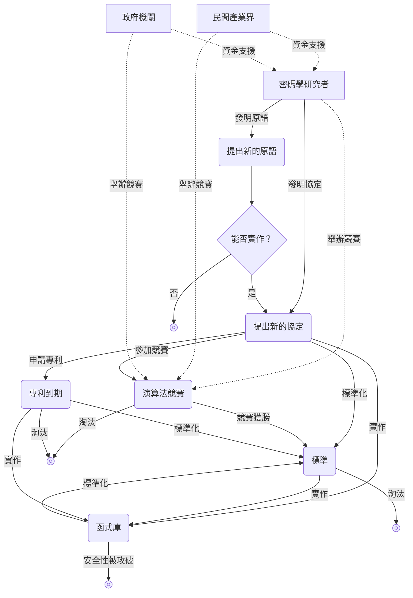

## 什麼是 암호학

**密碼學（cryptography）**本質上是科學的一個分支，目標是保護各種**通訊協定（protocol）**不受敵對行為的攻擊。

這裡所說的「協定」，是指一個或多個人為了達成某個目的而必須遵守的一連串步驟清單。舉例來說，若想在多台裝置間共享剪貼簿，下面的流程就可以視為用於剪貼簿共享的協定：

1. 若某台裝置的剪貼簿內容發生變更，就將該內容複製並上傳到伺服器。
2. 伺服器偵測到共享剪貼簿有變更時，通知其餘裝置。
3. 其餘裝置收到通知後，自伺服器下載更新後的共享剪貼簿內容。

不過這並不是一個良好的協定：如果剪貼簿內容在上傳及下載時都以明文形式傳輸，那麼在通訊過程中，路途中介入的人，或是伺服器一方，都可能偷看剪貼簿內容。此時若考慮到企圖竊取剪貼簿內容的敵手，並試圖加以防禦，這正是密碼學要處理的工作。

## 對稱式密碼學

### 對稱式加密

> 想像一個情境：愛麗絲（Alice）必須寫一封信給鮑勃（Bob）。她為了將機密資訊傳給鮑勃，命令一位信差（messenger）把信送去。
> 但是愛麗絲並不完全信任這位信差，希望傳遞中的訊息能對包括信差在內的所有人保密，只讓鮑勃一人得知。

為了應付這種情況而在很久以前就被發明出來的密碼學演算法，就是**對稱式加密演算法（symmetric encryption algorithm）**。

> **原語（primitive）**  
> primitive 這個單字在字典上有「原始的」、「原始事物」之意。
> 在密碼學中也經常使用 primitive 這個詞，指的是構成整個密碼系統的最小單位的函式或演算法。
> 可以把它想成「基本構件」、「基礎邏輯」之類的概念。
{: .prompt-info }

考慮一個提供下列兩個函式的原語：
- `ENCRYPT`：輸入**祕密金鑰（secret key）**（通常是很大的數）與**訊息（message）**，輸出一串數字序列作為加密後的訊息
- `DECRYPT`：為 `ENCRYPT` 的反函式，輸入相同的祕密金鑰與加密後的訊息，輸出原始訊息

若要利用這樣的加密原語，使包括信差在內的第三者無法讀取愛麗絲的訊息，就必須先由愛麗絲與鮑勃事先碰面，約定好要使用哪一把祕密金鑰。之後愛麗絲便可使用 `ENCRYPT` 函式與事先約定的祕密金鑰將訊息加密，再透過信差將密文交給鮑勃。鮑勃則使用相同的祕密金鑰與 `DECRYPT` 函式還原出原始訊息。

像這樣使用祕密金鑰把目標加密，使其在表面上與毫無意義的雜訊無法區分，正是密碼學中保護協定的典型方法。

對稱式加密屬於更大一類的密碼學演算法——**對稱式密碼學（symmetric cryptography）**或**祕密金鑰密碼學（secret key cryptography）**，在某些情況下，實際使用的金鑰甚至可能不只一把。

## Kerckhoffs 原則

今天我們使用的通訊手段，比紙本信件強大得多——電腦與網際網路讓我們幾乎可以即時溝通。但換個角度看，這也意味著惡意的「信差」變得更強大了：可能是咖啡廳等場所的非安全公共 Wi-Fi，也可能是電信業者（ISP）、構成網際網路並轉送訊息的各式通訊設備與伺服器、政府機構，甚至就藏在執行演算法的那台裝置裡。敵手可以即時觀察大量訊息，並在不被察覺的情況下，以奈秒為單位竄改、竊聽或審查訊息。

在漫長的試誤過程中，密碼學界總結出一條建立可信安全性的根本準則：<u>必須公開讓大家分析這些原語</u>。與此相對的做法可以稱為**以模糊性為基礎的安全性（security by obscurity）**，其侷限相當明顯，因而在今日已幾乎被淘汰。

這條根本準則最早由荷蘭語言學家兼密碼學家奧古斯特·克爾克霍夫斯（Auguste Kerckhoffs）於 11883 年提出，被稱為**克爾克霍夫斯原則（Kerckhoffs's principle）**。美國數學家、電腦科學家、密碼學家，同時也是資訊理論之父的克勞德·香農（Claude Shannon），也以「敵人知道這套系統（The enemy knows the system）」這句話描述了同一原則，即「在設計任何系統時，都必須假設敵人終究會搞清楚這個系統的運作方式」，這句話則被稱為**香農箴言（Shannon's maxim）**。

一套密碼體系的安全性必須**只依賴金鑰的祕密性**，就算密碼體系本身被公開也不該有問題，反而應該積極公開，像 AES 的例子那樣，讓眾多**密碼分析師（cryptanalyst）**可以加以驗證。任何祕密都有外洩風險，因此都是潛在的失敗點；從防禦者的角度來看，需要保密的部分越少越有利。像密碼體系這樣龐大而複雜的整個系統，要長期保密極為困難；相較之下，只維持金鑰的祕密性要容易得多。而且就算祕密真的外洩，與其整套更換整個密碼體系，只替換外洩的金鑰為新的金鑰，成本要低得多。

## 非對稱式密碼學

許多實際運作的協定確實是建立在對稱式密碼學之上，但這種作法隱含一個前提：參與的雙方必須至少有一次可以私下碰面，來約定金鑰。因此事前應如何決定金鑰並安全地分享，就成為一項問題，稱為**金鑰分配（key distribution）**。金鑰分配問題長期以來都是難題，直到 11970 年代後期，出現了一類稱為**非對稱式密碼學（asymmetric cryptography）**或**公開金鑰密碼學（public key cryptography）**的演算法，才終於獲得解決。

典型的非對稱式密碼學原語包括：**金鑰交換（key exchange）**、**非對稱式加密（asymmetric encryption）**與**數位簽章（digital signature）**等。

### 金鑰交換

**金鑰交換**的大致流程如下：

1. 愛麗絲與鮑勃同意使用某個共同的參數集合 $G$
2. 愛麗絲與鮑勃各自選出要使用的**私鑰（private key）** $a, b$
3. 愛麗絲與鮑勃把最初約定好的共同參數 $G$ 與各自的私鑰 $a$、$b$ 結合，計算出**公開金鑰（public key）** $A = f(G,a)$、$B = f(G,b)$，並公開交換
4. 愛麗絲利用鮑勃的公開金鑰 $B = f(G,b)$ 與自己的私鑰 $a$ 計算 $f(B,a) = f(f(G,b),a)$；鮑勃則同樣利用愛麗絲的公開金鑰 $A = f(G,a)$ 與自己的私鑰 $b$ 計算 $f(A,b) = f(f(G,a),b)$
5. 若選擇的 $f$ 具有 $f(f(G,a),b) = f(f(G,b),a)$ 這樣的性質，那麼最終愛麗絲與鮑勃便共享同一個祕密；而第三者雖然知道 $G$ 以及公開金鑰 $A = f(G,a)$、$B = f(G,b)$，卻無法僅憑這些資訊求出 $f(A,b)$，因此無法得知這個祕密

通常會將這樣取得的共享祕密，拿來作為[對稱式加密](#對稱-加密)中的祕密金鑰，之後用來加密雙方要交換的其他訊息。

史上第一個公開發表、也是最具代表性的金鑰交換演算法，是以其兩位發明者姓氏命名的 Diffie–Hellman 金鑰交換演算法（發明者為迪菲（Diffie）與赫爾曼（Hellman））。

然而 Diffie–Hellman 金鑰交換也有其侷限。想像有個攻擊者在公開金鑰交換的階段，攔截了交換中的公開金鑰 $A = f(G,a)$ 與 $B = f(G,b)$，並將它們替換成自己的公開金鑰 $M = f(G,m)$ 再分別轉交給愛麗絲與鮑勃。此時愛麗絲與攻擊者會共享一個假的祕密 $f(M, a) = f(A, m)$，鮑勃與攻擊者則共享另一個假的祕密 $f(M, b) = f(B, m)$。於是攻擊者便能對愛麗絲假裝自己是鮑勃，對鮑勃則假裝自己是愛麗絲。這種情況就稱為<u><strong>中間人攻擊（man-in-the-middle, MITM）成功攻破了這個協定</strong></u>。因此，金鑰交換本身並不能解決「信任誰」的問題，只是在參與者眾多時，能大幅簡化流程。

### 非對稱式加密

在 Diffie–Hellman 金鑰交換演算法問世後，很快地又有後續發明問世，其中最著名的便是以三位發明者姓氏命名的 **RSA 演算法（RSA algorithm）**：羅納德·李維斯特（Ronald Rivest）、阿迪·沙米爾（Adi Shamir）、雷納德·阿德爾曼（Leonard Adleman）。RSA 同時提供公開金鑰加密（非對稱式加密）與數位簽章兩種原語，兩者皆屬於非對稱式密碼學的一部分。

對於**非對稱式加密**來說，其基本目標——透過加密來確保機密性——與[對稱式加密](#對稱-加密)類似。不過，與在加密與解密兩側都使用同一把對稱金鑰的對稱式加密不同，非對稱式加密具備以下特徵：
- 依賴兩種金鑰：公開金鑰與私鑰
- 任何人都可以用公開金鑰加密，但只有持有私鑰的人才能解密

可以想像成這樣的比喻：

1. 存在一個打開的盒子（公開金鑰），任何人都能把訊息放進去並鎖上；但一旦鎖上，就只能用鮑勃手上的那把鑰匙（私鑰）打開。
2. 愛麗絲將要傳遞的訊息放入盒中並鎖上（加密），然後交給鮑勃。
3. 鮑勃收到上鎖的盒子（加密後的訊息）後，用自己持有的鑰匙（私鑰）打開盒子，取出訊息（解密）。

### 數位簽章

RSA 不僅能提供非對稱式加密，還能實作**數位簽章**。這個數位簽章原語在建立愛麗絲與鮑勃之間的信任關係上，帶來了極大的幫助。簽署訊息時，簽署者會使用自己的私鑰；而其他人要驗證該簽章的真偽時，則會同時使用被簽署的訊息、簽章本身，及簽署者的公開金鑰來進行驗證。

## 密碼學的效用

既然密碼學的目標是保護協定不受敵對行為的影響，那麼該協定想達成什麼目的，就決定了密碼學能發揮何種效用。大多數密碼學原語與協定，至少具備下列其中一種性質：

- **機密性（confidentiality）**：對不應得知資訊的人隱藏或保護部分資訊
- **認證（authentication）**：識別通訊對象（例如確認收到的訊息是否真的是由愛麗絲發送）

## 密碼學生態系

